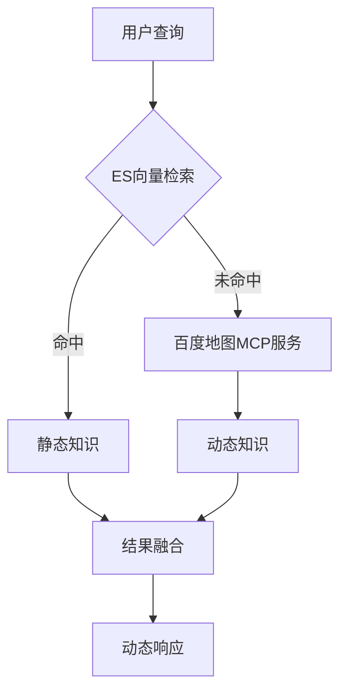
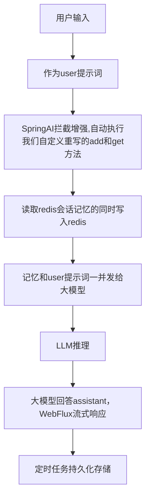
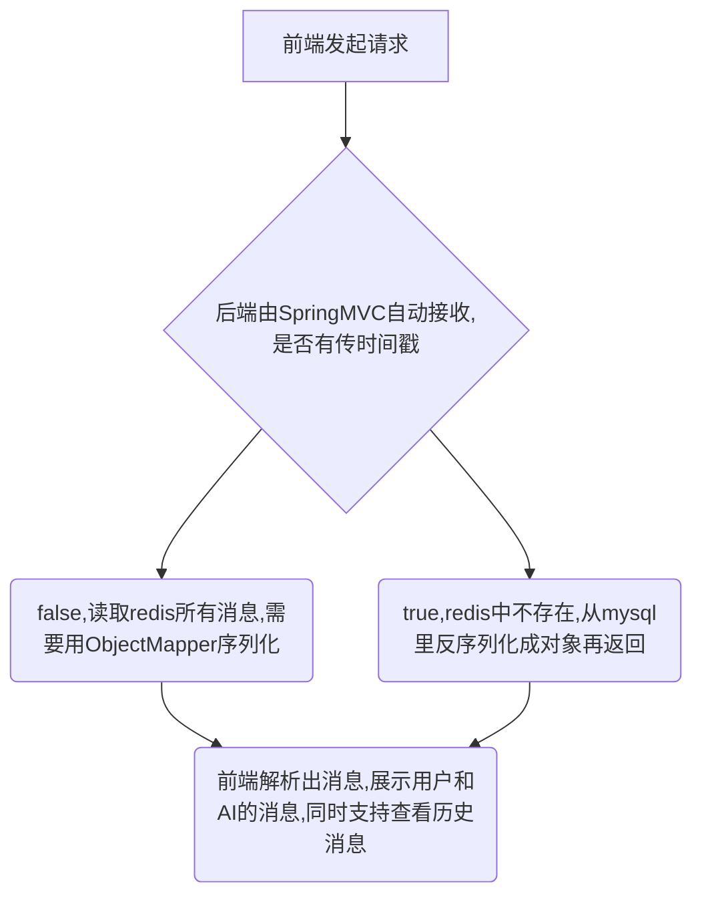

## 📌 项目描述
针对旅游场景中个性化需求多样化、实时信息更新滞后等痛点，基于**RAG架构**构建多模态旅行对话系统。通过整合本地知识库与实时数据服务，解决传统推荐系统知识静态化、交互形式单一等问题，实现：
- 🗺️ 智能行程规划
- 💬 多模态对话交互
- 📊 动态信息融合

## 🛠️ 技术栈
### 核心技术
- 🔍 **向量检索**：Elasticsearch（余弦相似度阈值≥0.75）
- 💾 **会话记忆**：Redis Sorted Set（会话滑动窗口，根源上避免大KEY）
- 🎯 **历史会话记录持久化** : 采用SpringTask(cron表达式)每隔10分钟将redis数据批量持久化到数据库
- 🎙️ **多模态交互**：图像/音频识别（Omni模型端到端延迟<1.2s）

### 工具链
| 类别        | 技术栈                                  |
|-------------|---------------------------------------|
| 框架        | Spring Boot 3.x + Spring AI           |
| 数据服务    | 百度地图MCP（POI/天气/交通数据）          |
| 模型平台    | 阿里云百炼模型广场 + 千问大模型           |
| 响应优化    | WebFlux（流式响应，延迟从5s→800ms）      |

## 🚀 核心技术与实现

### 1. 静态知识+实时检索双引擎架构

• 本地知识库：通过千问模型将旅行手册/攻略向量化存储于ES

• 实时数据层：

🔧 ToolCallBackProvider + JSON配置基于stdio方式实现服务调用

📡 动态数据标注格式：[实时数据显示今天下午会下雨]（用户可信度+50%）

### 2. 上下文感知推荐引擎

• 记忆优化：

💾 Redis Sorted Set  实现滑动窗口（避免大Key问题）

🗃️ 定时任务每隔10分钟持久化到MySQL（历史会话记录保留策略）

• Prompt工程：

📜 系统指令集：预算收集/出发时间/游玩周期等规则定义

🎯 用户偏好收集（准确率90%）

### 3. 多模态交互系统

|模态	|技术实现	|性能指标|
|-----|---------|---------|
|🖼️ 图像识别	|千问Omni多模态模型	|准确率90%|
|🎤 语音交互	|千问Omni多模态模型	|端到端延迟<1.2s|

### 4. 历史聊天记录

🏆 **项目成果**

✅ 信息准确率：75% → 92%（提升17%）

✅ 用户信任度：可信度增长40%（数据标注机制）

✅ 交互体验：

平均会话时长 +25%

响应延迟 5s → 800ms（WebFlux优化）

✅ 系统稳定性：

Redis会话大Key问题解决

大模型知识库过时率降低90%

📌 **创新点总结**

**动态优先级机制**：实时数据驱动回答调整

**混合存储架构**：ES+Redis+MySQL三级存储

**多模态融合**：文本/图像/语音全模态支持

**工程化优化**：WebFlux流式响应 + 会话窗口控制
